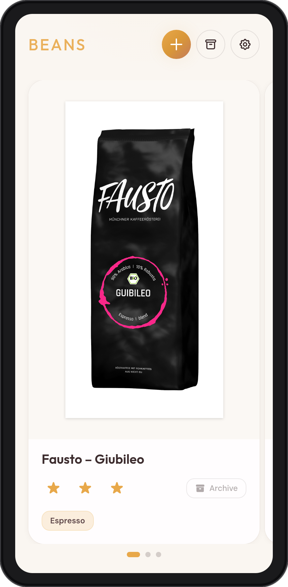
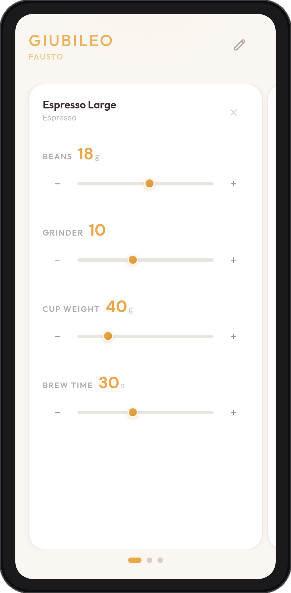
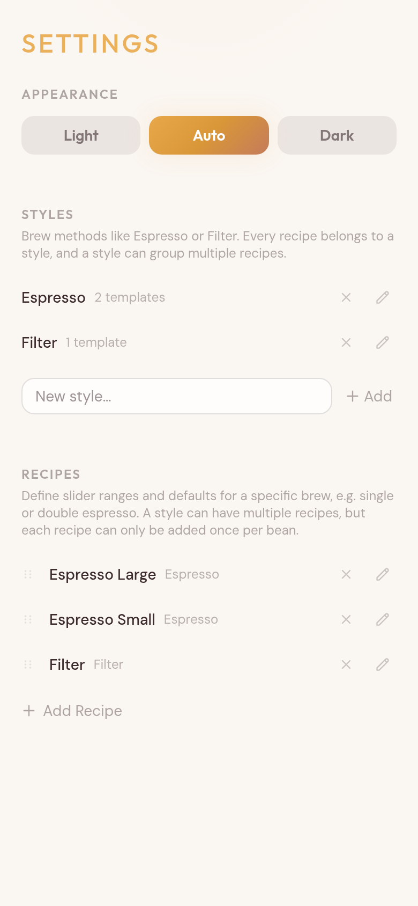
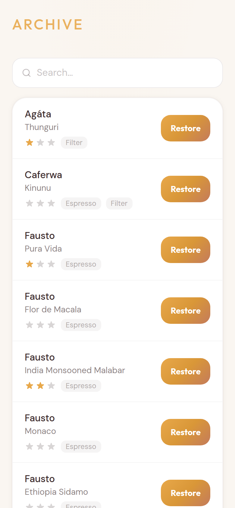
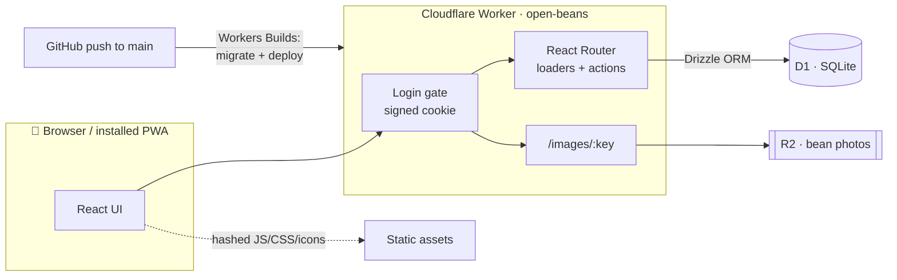

<div align="center">


# Open Beans

**Dial in your perfect brew.**

A minimal, mobile-first coffee tracker, made for **single dosers**: when you
weigh in beans per shot and keep several bags open at once, every bean needs
its own grinder setting, dose, and brew time. Open Beans keeps every bag on
a swipeable shelf — with a photo, a rating, and one auto-saving recipe per
brew style — so the next espresso starts where the last one left off, not
from memory. Entirely serverless on Cloudflare's free tier: no server to
run, nothing to back up, installs like an app.

[](https://reactrouter.com)
[](https://www.typescriptlang.org/)
[](https://workers.cloudflare.com)
[](https://developers.cloudflare.com/d1/)
[](https://orm.drizzle.team)
[](https://tailwindcss.com)
[](#-install-it-like-an-app)
[](LICENSE)

<br />

&nbsp;
&nbsp;


</div>

---

## Contents

- [Feature Tour](#feature-tour)
- [How It's Built](#how-its-built)
- [Self-Hosting Guide](#self-hosting-guide)
  - [1. Prerequisites](#1-prerequisites)
  - [2. Clone and Install](#2-clone-and-install)
  - [3. Create the D1 Database and R2 Bucket](#3-create-the-d1-database-and-r2-bucket)
  - [4. Run It Locally](#4-run-it-locally)
  - [5. Deploy](#5-deploy)
  - [6. Add a Custom Domain](#6-add-a-custom-domain)
  - [7. Turn On the Login Gate](#7-turn-on-the-login-gate)
- [Migrating from the Flask Version](#migrating-from-the-flask-version)
- [Install It Like an App](#-install-it-like-an-app)
- [Security Model](#security-model)
- [Development](#development)
- [Project Structure](#project-structure)
- [License](#license)

---

## Feature Tour

### 🫘 Your Open Bags, One Shelf


Every bag you're currently brewing is a full-height card in a snap-scrolling
carousel: photo of the bag, a 1–3 star rating, and pills showing which brew
styles you've dialled in for it. Swipe between bags, tap one to get to its
recipes — and when a bag is empty, one tap archives it.

<br clear="right" />

### 📦 The Archive Remembers Every Bag



Archived beans aren't gone — they're the app's memory. Every bag you've ever
finished sits in a searchable list with its rating, its style chips, and all
of its recipes fully intact.

This is where the app pays off: rebuy a bean months later, hit **Restore**,
and it's back on the shelf with the exact grinder setting, dose, and brew
time you'd dialled in last time. No re-dialling, no guessing which of the
three-star bags it was — the search box finds it by brand or name.

<br clear="left" />

### ⏱️ Recipes That Save Themselves


Each bean holds one recipe per template — single espresso, double espresso,
filter — as cards in a carousel. A recipe is four sliders: **bean amount**,
**grinder setting**, **cup weight**, and **brew time**, each with +/− buttons
for single-step nudges.

There is no save button. Move a slider and the value is persisted moments
later; walk away mid-adjustment and nothing is lost. Ranges, step sizes and
starting values all come from the recipe template.

<br clear="right" />

### 🏷️ Styles and Templates, Yours to Shape


**Styles** are brew methods — Espresso, Filter, whatever you drink — and
group the recipe templates. **Templates** define a specific brew (e.g.
*Espresso Small*): min, max, step, and default for each of the four sliders.
Add as many as you like, drag to reorder them, and each template can be
added once per bean.

The theme — light, dark, or follow-the-system — lives here too, stored in
the database so every device agrees.

<br clear="left" />

### 🔐 One Passphrase, Once per Device

The Worker ships a built-in login gate: enter your passphrase once on each
device and a signed cookie keeps you in for a year. Pages, data, and photos
are all behind it — no Cloudflare Access, no OAuth dance, no session that
expires mid-espresso. Changing the secret logs out every device at once.

---

## How It's Built

**No servers, no containers.** One Cloudflare Worker serves the
server-rendered React app, gates every request behind the login cookie, and
talks to D1 (SQLite) through Drizzle. Bean photos are downscaled in the
browser before upload and streamed out of a private R2 bucket by the same
Worker. Pushing to `main` deploys via Workers Builds.



| Layer | Choice |
|---|---|
| Framework | React Router 8 (framework mode, SSR) + React 19 + TypeScript |
| Runtime | Cloudflare Workers |
| Database | Cloudflare D1 (SQLite) via Drizzle ORM, migrations via `drizzle-kit` + `wrangler` |
| Photos | Cloudflare R2, private bucket; client-side canvas downscale before upload |
| Styling | Tailwind CSS 4, the original app's design tokens ported to `@theme` |
| Drag & drop | dnd-kit (template reordering) |
| Auth | Hand-rolled passphrase gate in the Worker — HMAC-signed year-long cookie |
| CI/CD | Cloudflare Workers Builds — build, apply D1 migrations, deploy on push |

The schema intentionally keeps the table and column names of the original
Flask/SQLAlchemy app, so data from a legacy instance imports without any
transformation.

---

## Self-Hosting Guide

One Worker, one D1 database, one R2 bucket — all comfortably inside
Cloudflare's free tier.

### 1. Prerequisites

- A [Cloudflare](https://dash.cloudflare.com) account
- Node.js **20+** and npm
- A GitHub account, if you want push-to-deploy

### 2. Clone and Install

```bash
git clone <your-fork-url>
cd open-beans
npm install
```

### 3. Create the D1 Database and R2 Bucket

```bash
npx wrangler login
npx wrangler d1 create open-beans-db
npx wrangler r2 bucket create open-beans-images
```

Copy the `database_id` that `d1 create` prints into
[`wrangler.jsonc`](wrangler.jsonc), then create the tables:

```bash
npm run db:migrate:remote
```

### 4. Run It Locally

```bash
npm run db:migrate:local   # tables in the local D1 emulator
npm run dev                # http://localhost:5173
```

On an empty database the app seeds the default styles (Espresso, Filter) and
three recipe templates on first request — add a bean and you're brewing.

### 5. Deploy

**Push-to-deploy (recommended).** In the dashboard: **Workers & Pages →
Create → Import a repository**, pick your fork, and configure:

| Setting | Value |
|---|---|
| Project name | `open-beans` (must match `name` in `wrangler.jsonc`) |
| Build command | `npm run build` |
| Deploy command | `npx wrangler d1 migrations apply DB --remote && npx wrangler deploy` |

Every push to `main` now builds, applies pending migrations, and deploys.
Future schema changes are just: edit `app/db/schema.ts`, `npm run
db:generate`, commit.

**Or from your machine:** `npm run deploy`.

> `wrangler.jsonc` sets `workers_dev: false` — the Worker is only reachable
> through the custom domain you attach next, and deploys can't silently
> re-enable the `workers.dev` URL.

### 6. Add a Custom Domain

Dashboard → your Worker → **Settings → Domains & Routes → Add → Custom
domain**. Cloudflare creates the DNS record and certificate; the app is live
seconds later.

### 7. Turn On the Login Gate

Dashboard → your Worker → **Settings → Variables and Secrets** → add a
**Secret** named `AUTH_PASSPHRASE` with a passphrase you can type on a phone
keyboard. It takes effect immediately — no redeploy.

Until the secret exists the gate is off (fail-open), so a fresh deploy can
never lock you out.

---

## Migrating from the Flask Version

Coming from the original
[coffee-beans-tracker](https://github.com/thkleinert/coffee-beans-tracker)?
Your data ports losslessly. Do this **before** first visiting the deployed
app — an empty database seeds default styles/templates on first request,
which would collide with imported IDs (if that happened, the wipe command is
below).

```bash
# 1. Export the old data as D1-ready SQL (explicit column names,
#    image paths rewritten from /static/uploads/* to /images/*)
python3 scripts/export-data.py /path/to/old/instance/db.sqlite > data.sql

# 2. Import into D1
npx wrangler d1 execute open-beans-db --remote --file=data.sql

# 3. Upload the bean photos to R2 (filenames must stay unchanged)
cd /path/to/old/static/uploads
for f in *; do npx wrangler r2 object put "open-beans-images/$f" --file "$f" --remote; done
```

Stop the old container before copying `db.sqlite` so nothing writes to it
mid-copy. If the app seeded defaults before your import, clear them first:

```bash
npx wrangler d1 execute open-beans-db --remote --command \
  "DELETE FROM recipe; DELETE FROM recipe_template; DELETE FROM tag; DELETE FROM app_settings;"
```

Older databases (before the templates feature) leave recipes unlinked from
templates; link them by name afterwards:

```bash
npx wrangler d1 execute open-beans-db --remote --command \
  "UPDATE recipe SET template_id=1, name='Espresso Small' WHERE template_id IS NULL AND name IN ('Small','small');
   UPDATE recipe SET template_id=2, name='Espresso Large' WHERE template_id IS NULL AND name='Large';
   UPDATE recipe SET template_id=3 WHERE template_id IS NULL AND name='Filter';"
```

To rehearse the whole thing safely, run the same commands with `--local` and
check the result with `npm run dev`.

---

## 📲 Install It Like an App

Open Beans is an installable PWA. On your phone, open your domain in the
browser, log in once, and use **Add to Home Screen** (iOS Safari) or the
install prompt (Android Chrome). You get a full-screen app with
pull-to-refresh, and the login cookie means you won't see the gate again on
that device for a year.

The service worker is deliberately a pass-through — it exists for
installability and never caches data, so the app always shows the current
state and two devices never disagree.

---

## Security Model

- **Everything dynamic sits behind the login gate.** The Worker checks the
  cookie before React Router ever runs: pages, form actions, data requests,
  and the `/images/*` photo proxy all require it. Only the fingerprinted
  static assets (JS/CSS bundles, icons, manifest) are public — they contain
  no data.
- **The cookie is an expiry timestamp signed with HMAC-SHA256** (keyed by
  your passphrase), `HttpOnly`, `Secure`, `SameSite=Lax`, valid for one
  year. There is no session store to leak or maintain; **rotating the
  passphrase invalidates every cookie instantly**. Login responses compare
  HMACs rather than raw strings, so timing doesn't leak the passphrase.
- **Fail-open by design, once.** With no `AUTH_PASSPHRASE` secret set the
  gate is disabled — that's what makes the first deploy safe. Set the secret
  as part of setup and verify you get the login page before putting real
  data in.
- **Photos are private.** The R2 bucket has no public access; images are
  streamed through the authenticated Worker route with immutable cache
  headers (keys are unique per upload). Uploads are validated server-side
  (image MIME, 8 MB cap) *and* downscaled client-side to ≤1280 px JPEG.
- **The database is never exposed.** D1 is reachable only through the
  Worker's Drizzle queries; all mutations are POST actions.
- **Single-user by scope.** There are no accounts or roles — one passphrase
  guards one household's coffee data. If you need per-user data or audit
  trails, put Cloudflare Access in front instead (and accept its
  session-expiry UX inside an installed PWA).

---

## Development

```bash
npm run dev                # Vite dev server + local D1/R2 emulators
npm run db:migrate:local   # apply migrations to the local database
npm run db:generate        # generate a migration from schema.ts changes
npm run typecheck          # wrangler types + react-router typegen + tsc
npm run build              # production build
npm run deploy             # build + deploy from your machine
```

Put `AUTH_PASSPHRASE=whatever` in `.dev.vars` (gitignored) to exercise the
login gate locally; leave it unset to skip it.

---

## Project Structure

```
app/
  root.tsx               Layout, theme script, pull-to-refresh, SW registration
  routes.ts              Route config
  app.css                Tailwind 4 theme — the legacy design tokens
  db/
    schema.ts            Drizzle schema (legacy-compatible names)
    index.ts             D1 client + first-run seeding
  lib/
    images.server.ts     R2 upload with validation
    image-client.ts      Canvas downscale before upload
  components/            RecipeCard (sliders), StarRating, TemplateForm,
                         ThemeToggle, carousel dots, icons
  routes/                home, bean, add, archive, settings,
                         template-new/edit, images (R2 proxy), theme
workers/app.ts           Worker entry: login gate + React Router handler
drizzle/                 Generated SQL migrations (applied by wrangler)
scripts/export-data.py   Legacy SQLite → D1 export
public/                  PWA manifest, icons, pass-through service worker
docs/screenshots/        README screenshots
wrangler.jsonc           Bindings: DB (D1), IMAGES (R2); workers_dev off
```

---

## License

[MIT](LICENSE) © Thomas Kleinert — fork it, self-host it, make it yours.

---

<div align="center">
  <sub>
    The serverless rewrite of
    <a href="https://github.com/thkleinert/coffee-beans-tracker">coffee-beans-tracker</a>.
    Built with <a href="https://reactrouter.com">React Router</a>,
    <a href="https://workers.cloudflare.com">Cloudflare Workers</a> &
    <a href="https://orm.drizzle.team">Drizzle</a>.
  </sub>
</div>
